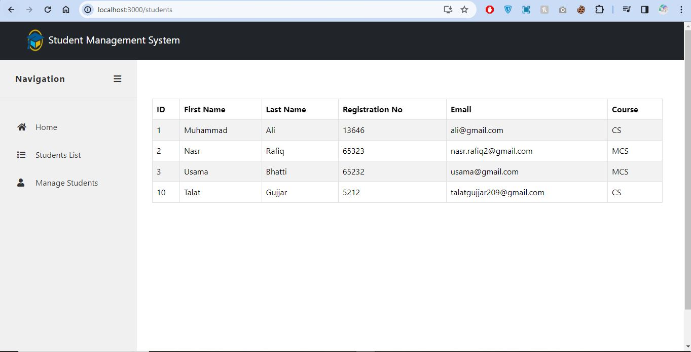
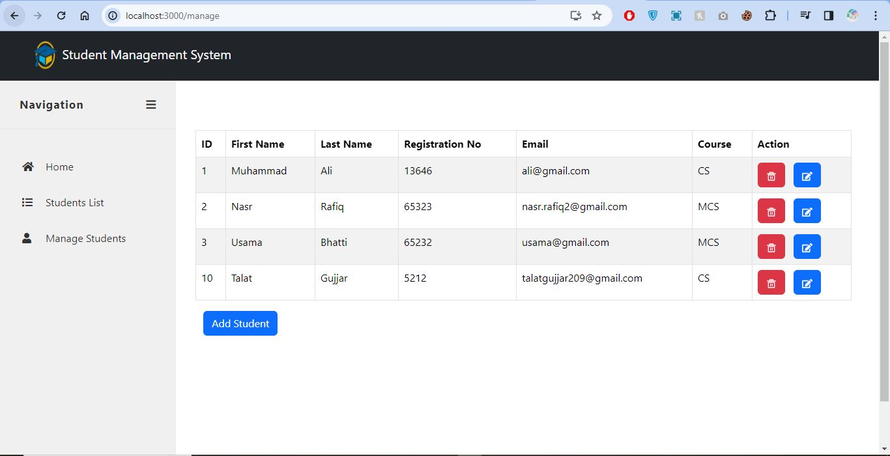
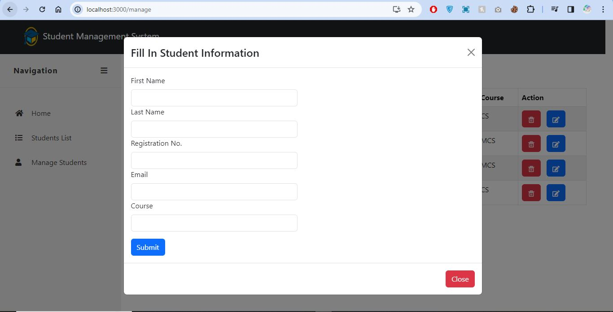

# Student Management System - Django Rest Framework API and React Frontend

## Overview

This project is a Student Management System implemented using Django Rest Framework for the backend API and React for the frontend. The API provides functionalities to add, edit, view, and delete student records.

## Prerequisites

Before running the application, ensure that you have the following software installed on your system:

- [Python](https://www.python.org/)
- [Node.js](https://nodejs.org/)
- [npm (Node Package Manager)](https://www.npmjs.com/) - installed with Node.js
- [Django](https://www.djangoproject.com/)
- [Django Rest Framework](https://www.django-rest-framework.org/)
- [React](https://reactjs.org/)

## Backend Setup

1. Open a terminal and navigate to the `backend` directory.

2. Install the required Python packages:

    ```bash
    pip install -r requirements.txt
    ```

3. Apply the database migrations:

    ```bash
    python manage.py migrate
    ```

4. Run the Django development server:

    ```bash
    python manage.py runserver
    ```

   The backend API should now be accessible at http://localhost:8000/.

## Frontend Setup

1. Open a new terminal window and navigate to the `frontend` directory.

2. Install the required Node.js packages:

    ```bash
    npm install
    ```

3. Start the React development server:

    ```bash
    npm start
    ```

   The React frontend should now be accessible at http://localhost:3000/.


# Application Architecture


## Snaps










